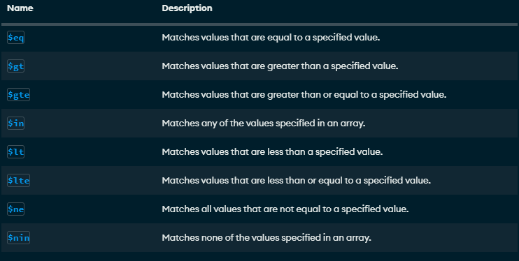
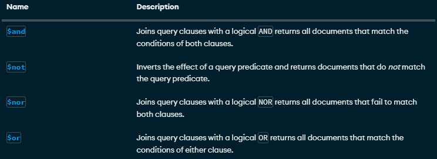

# CRUD y consultas en MongoDB

## Crear una base de datos
Solo se crea si contiene por lo menos una colección
use bd1

## Cómo crear una colección
use bd1
db.createCollection("Empleado")

## Mostrar las colecciones
show collections

## Insertar un documento
```json
db.coleccion.insertOne(
    {
        nombre: 'Estefany',
        apellido1: 'Vazquez',
        edad: 22,
        ciudad: 'Huehuetoca'
    }
)
```

## Inserción de un documento más complejo con array
```json
db.alumnos.insertOne(
 {
   nombre: "Martha",
   apellido: "Trinidad",
   apellido2: "Hernandez",
   edad: 19,
   aficiones: [
                 "Dibujo", "Videojuegos", "Musica"
              ]
 }
 )
 ```

 ## Inserción de documentos más complejos con documentos anidados
 ```json
db.alumnos.insertOne(
 {
    nombre: "Naomi",
    apellido: "Mondragon",
    apellido2: "Martinez",
    edad: 20,
    estudios: [
      "Licenciatura en Derecho",
      "Licenciatura en Psicología",
      "Licenciatura en Logística"
    ],
       esperiencia: {
        lenguaje: "SQL", sbd: "SQL Server", AniosExp: 2
        }
 }
 )

db.alumnos.insertOne(
 {
    _id: 3,
    nombre: "Sorge",
    apellido: "Huaso",
    apellido2: "Villegas",
    edad: 23,
    aficiones: [
      "Dinero",
      "Hombres",
      "Fiesta"
    ],
       talenos: { 
        embriagarse: true,
        bañarse: false
        }
 }
 ) 
 ```

## Insertar múltiples documentos 
 ```json
db.alumnos.insertMany([
  { 
    _id: 12, 
    nombre: "Nancy", 
    apellido: "Gonzales", 
    edad: 24, 
    descripcion: "Es una chistosa" 
  },
  { 
    nombre: "Dan", 
    apellido: "Urtiz", 
    edad: 24, 
    habilidades: ["Programar", "Redactar", "Analizar"], 
    Direcciones: { 
      calle: "Santa Anita", 
      numero: "123" 
    }, 
    esposas: [ 
      { 
        nombre: "Yanahi", 
        edad: 23, 
        pension: "2800", 
        hijos: ["Maximiliano", "Alan"]
      },
      {
        nombre: "Yolotzin", 
        edad: 32, 
        pension: "6500.35", 
        complaciente: true 
      }
    ]
  }
])
 ```

 # Práctica 1

 ## Cargar datos
 [Libros.json](./data/libros.json)

## Búsquedas. Condiciones Simples de Igualdad. Método find()
 1. Seleccionar todos los documentos de la colección 'libros'

 ```json
 db.libros.find({})
 ```

 2. Seleccionar o mostrar todos los documentos que sean de la editorial biblio

```json
 db.libros.find({editorial:'Biblio'})
 ```

 3. Mostrar todos los documentos que el precio sea 25

```json
 db.libros.find({precio:25})
 ```

 4. Seleccionar todos los documentos dónde el título sea json para todos

 ```json
 db.libros.find({titulo:'JSON para todos'})
 ```

 ## Operadores de Comparación
[Operadores de comparación](https://www.mongodb.com/docs/manual/reference/operator/query/)



1. Mostrar todos los documentos donde el precio sea mayor a 25

```json
db.libros.find({ precio: { $gt: 25 } })
```

2. Mostrar los documentos donde el precio sea 25
```json
db.libros.find({ precio: { $eq: 25 } })
```

3. Mostrar los documetos que cuya cantidad sea menor a 5

```json
db.libros.find({ cantidad: { $lt: 5 } })
```

4. Mostrar los documentos que pertenezcan a la editorial Biblio ó Planeta

 ```json
db.libros.find({ editorial: { $in: ['Biblio', 'Planeta'] } })
 ```

 5. Mostrar todos los documentos de libros que cuesten 20 o 25

 ```json
db.libros.find({ precio: { $in: [20, 25] } })
 ```

 6. Mostrar todos los documentos de libros que no cuesten 20 o 25
 
```json
db.libros.find({ precio: { $nin: [20, 25] } })
```

7. Mostrar el primer domento de libros que cuesten 20 o 25

```json
 db.libros.findOne({ precio: { $in: [20, 25] } } )
```
## Operadores lógicos
[Operadores de lógicos](https://www.mongodb.com/docs/manual/reference/operator/query/)



### Operador AND

Dos posibles opciones de AND

1. La simple, mediante condiciones separadas por comas

***sintaxis***

db.coleccion.find({condicion1, condicion2}) -> Con esto asume que es una ***and***

2. Usando el operador $and

***sintaxis***

db.coleccion.find( {$and: [ {condicion1}, {condicion2} ] } )

1. Mostrar todos aquellos libros que cuesten más de 25 y cuya cantidad sea inferior a 15

***forma simple***

```json
db.libros.find({ precio: { $gt: 25 }, cantidad: { $lt: 15 } } )```

***AND***

```json
db.libros.find( {$and: [ {precio:{$gt:25}}, {cantidad: {$lt:15}} ] } )
```

2. Mostrar todos aquellos libros que cuesten más de 25 y cuya cantidad sea inferior a 15 y id 

```json
db.libros.find({ precio: { $gt: 25 }, cantidad: { $lt: 15 }, _id:4 } )
```

```json
db.libros.find({ precio: { $gt: 25 }, cantidad: { $lt: 15 }, _id:{$eq:4} } )
```

```json
db.libros.find(
    {
      $and:[
        {precio:{$gt:25}},
        {cantidad: {$lt:15}}
      ]
    }
)
```

### Operador OR

**Sintaxis:**

json
db.libros.find({$or:[{condicion1},{condicion2}]})


#### Ejercicios 

1. Mostrar todos aquellos libros que cuesten más de 25 o cuya cantidad sea inferior a 15 ####
```json
db.libros.find({$or:[{precio:{$gt:25}},{cantidad:{$lt:15}}]})
```

### AND y OR combinados

1. Mostrar los libros de la editorial biblio con precio mayor a 40 o libros de la editorial planeta con precio mayor a 30
```json
db.libros.find(
{
    $or: [
        {$and:[{editorial:'Biblio'}, {precio:{$gt:30}}]},
        {$and:[{editorial:{$eq:'Planeta'}}, {precio:{$gt:20}}]}
    ]
})
```

## Proyección de columnas
```
db.coleccion.find(filtro, columnas)
```

```json
db.libros.find({}, {titulo: 1})
```

1. Seleccionar todos los documentos, mostrando el título y la editorial

```json
db.libros.find({},{titulo:1, editorial:1})
db.libros.find({},{titulo:1, editorial:1, _id:0})

```

2. Seleccionar todos los documentos de la editorial planeta, mostrando solamente el título y la editorial

```json
db.libros.find({editorial:"Planeta"}, {titulo:1, editorial:1, _id:0})
```